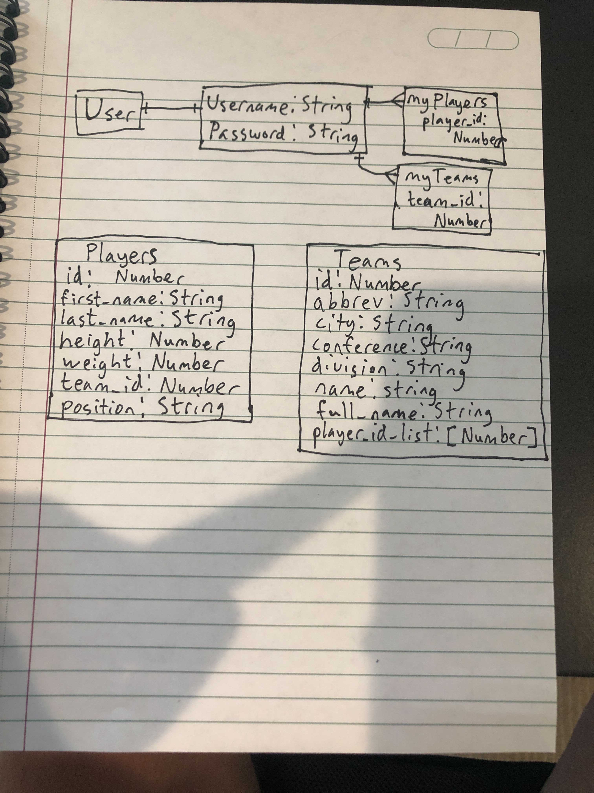
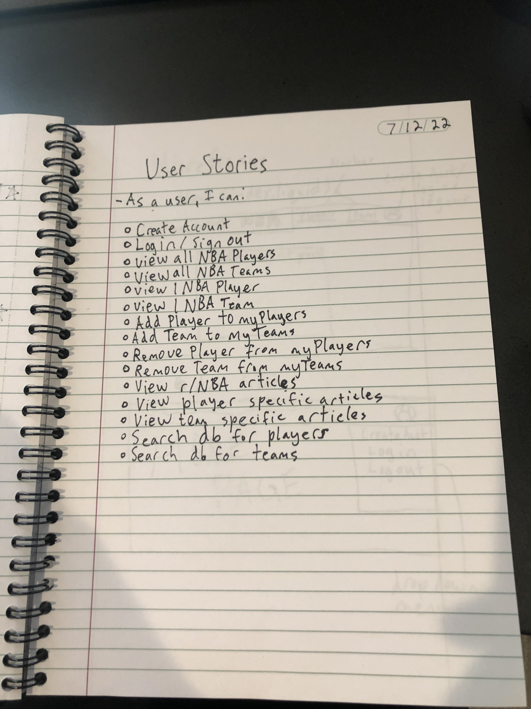
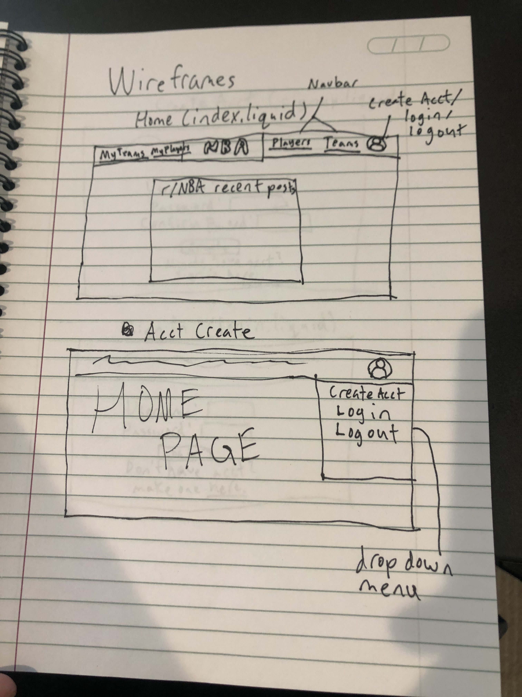
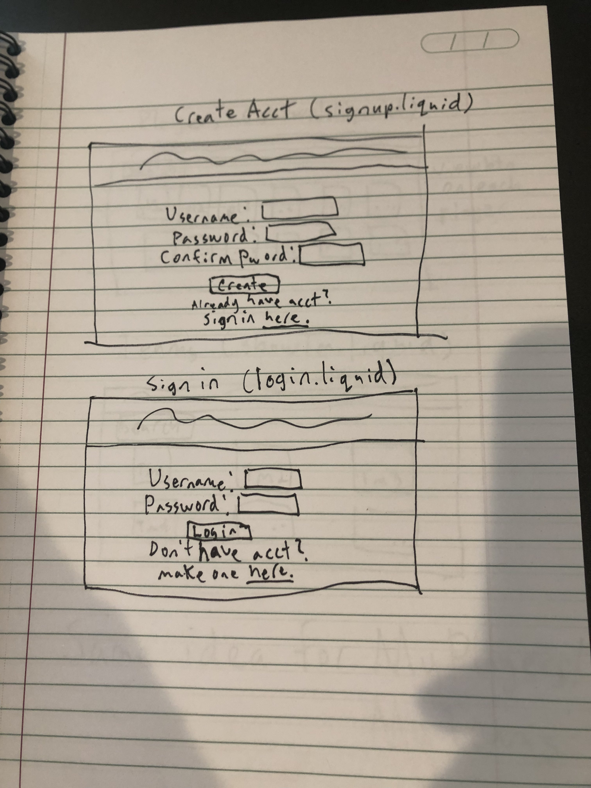
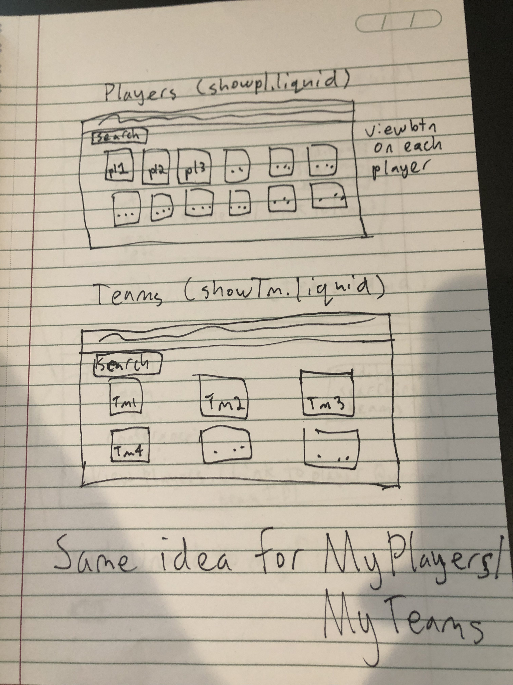
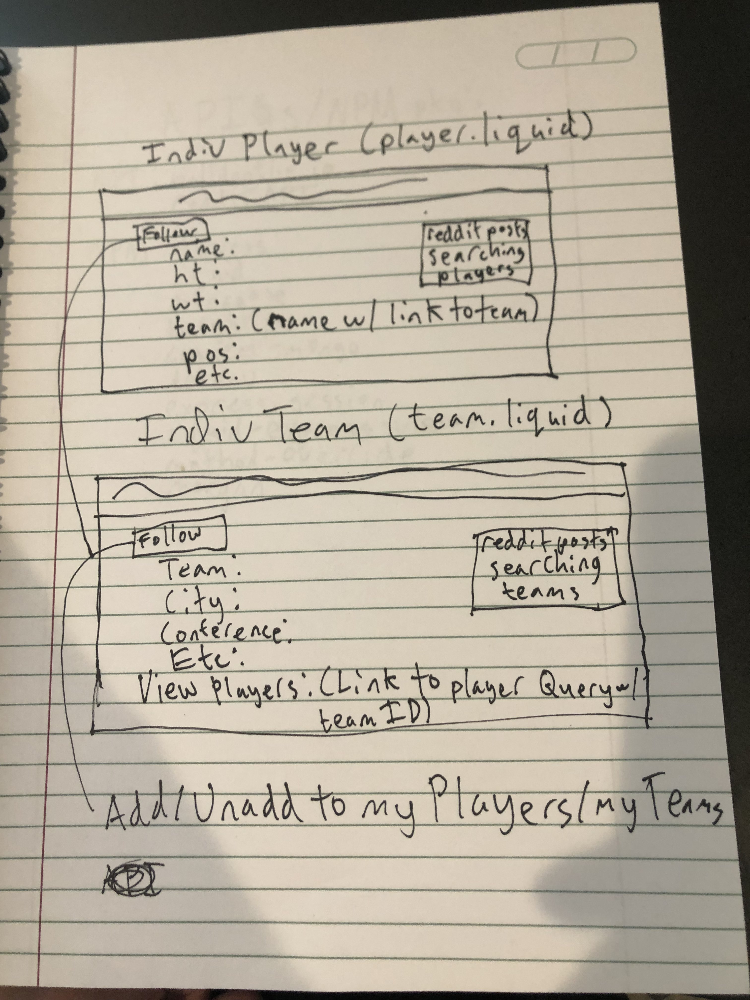
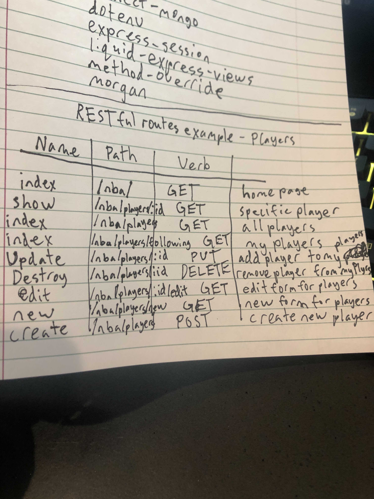

# NBA-api-utility

# Project planning:

# Models ERD:

# User Stories

# Wireframes

# API's, NPM Packages, and RESTful Route Guide

## The API
- The link to the api is https://www.balldontlie.io/#introduction. The Balldontlie API is where all of the player data is gathered and seeded from.